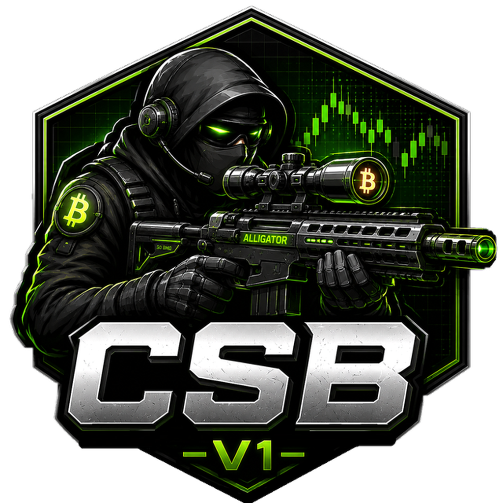

<div align="center">



# Crypto Sniper Bot

### The multi-chain sniper that acts in milliseconds

Buy the exact moment a token launches. Shield yourself from bots with **MEV protection** and **anti-honeypot**. Exit in profit automatically with **take-profit / stop-loss** — all from one terminal.

<br>

[](https://github.com/CryptoSniperBR/Crypto_Sniper_Bot_Updates/releases/latest)
[](https://cryptosniper.com.br)
[](https://t.me/CryptoSniperFR33)

[](https://github.com/CryptoSniperBR/Crypto_Sniper_Bot_Updates/releases/latest)
[](https://github.com/CryptoSniperBR/Crypto_Sniper_Bot_Updates/releases)


</div>

---

## ⬇️ Download

Pick the file for **your system**. Desktop builds **update themselves** — you only download once.

| System | What you get | Download |
|---|---|---|
| 🪟 **Windows** 10/11 | Installer `.exe` | **[⬇️ Download for Windows](https://github.com/CryptoSniperBR/Crypto_Sniper_Bot_Updates/releases/latest)** |
| 🤖 **Android** 7.0+ | Mobile app `.apk` | **[⬇️ Download for Android](https://github.com/CryptoSniperBR/Crypto_Sniper_Bot_Updates/releases/latest)** |
| 🍎 **macOS** — Apple Silicon | Installer `.dmg` | **[⬇️ Download for Mac (M1–M4)](https://github.com/CryptoSniperBR/Crypto_Sniper_Bot_Updates/releases/latest)** |
| 🍎 **macOS** — Intel | Installer `.dmg` | **[⬇️ Download for Mac (Intel)](https://github.com/CryptoSniperBR/Crypto_Sniper_Bot_Updates/releases/latest)** |
| 🐧 **Linux** — any distro | Portable `.AppImage` | **[⬇️ Download AppImage](https://github.com/CryptoSniperBR/Crypto_Sniper_Bot_Updates/releases/latest)** |
| 🐧 **Linux** — Debian/Ubuntu | Package `.deb` | **[⬇️ Download .deb](https://github.com/CryptoSniperBR/Crypto_Sniper_Bot_Updates/releases/latest)** |

> 👉 **[See every file on the latest release page →](https://github.com/CryptoSniperBR/Crypto_Sniper_Bot_Updates/releases/latest)**
>
> 💡 **Which Mac do I have?** Apple menu  → **About This Mac**. *"Chip Apple M…"* → Apple Silicon. *"Intel Processor"* → Intel.

<details>
<summary><b>📦 Installation notes — click to expand</b></summary>

<br>

**🪟 Windows** — run the `.exe`. If SmartScreen warns you, click **More info → Run anyway**. The warning appears because we don't yet have a paid code-signing certificate — not because anything is wrong with the app.

**🤖 Android** — open the `.apk`. Android will ask you to allow installs from this source (**Settings → Install unknown apps → Allow**). That's normal for any app distributed outside the Play Store.

**🍎 macOS** — open the `.dmg`, drag the app into **Applications**. On the **first launch only**, right-click the app → **Open → Open** to clear Gatekeeper.

**🐧 Linux (AppImage)**
```bash
chmod +x CryptoSniper-*.AppImage
./CryptoSniper-*.AppImage
```

**🐧 Linux (.deb)**
```bash
sudo dpkg -i CryptoSniper-*.deb
```

</details>

---

## ⚡ What it does

| | Feature | |
|:--:|---|---|
| 🎯 | **Launch sniping** | Fire the buy the instant liquidity opens — no manual timing. |
| ⚡ | **Real-time mempool** | Watch pending transactions and act before the block confirms. |
| 🛡️ | **MEV protection** | Private relays shield your trade from sandwich attacks and front-running. |
| 🚫 | **Anti-honeypot & rug check** | Simulates the sell *before* you buy. If you can't exit, you don't enter. |
| 📈 | **Auto take-profit / stop-loss** | Set your targets once; the bot exits for you, day or night. |
| 📉 | **Trailing stop** | The stop level rises with the price — locks in gains without capping them. |
| 🐋 | **Whale tracking & copy trading** | Mirror the wallets that consistently win. |
| 🔁 | **Loop mode** | Repeat a strategy automatically across launches. |
| 📊 | **Live charts** | Every token charted on its **deepest-liquidity pool**, contract always one click from your clipboard. |
| 🗺️ | **Top-1000 market map** | The whole market as a live heat map — click any coin to load it instantly. |

---

## 🌐 13 networks — EVM + Solana in one app

<div align="center">

| | | | |
|:--:|:--:|:--:|:--:|
| **Ethereum** | **BNB Chain** | **Base** | **Polygon** |
| **Arbitrum** | **Avalanche** | **Fantom** | **Cronos** |
| **Linea** | **zkSync Era** | **Monad** | **Robinhood** |
| **Solana** | | | |

</div>

---

## 🔐 Security — your keys never leave your machine

**100% non-custodial.** Your private key is encrypted at rest on **your own computer** and is never transmitted to us. We have no server that can touch your funds, because there is nothing to touch.

- 🔑 **Local-only keys** — encrypted at rest, never uploaded
- 🧪 **Sell-simulation before every buy** — honeypots get rejected up front, not discovered too late
- 🛡️ **MEV-protected routing** — your trade isn't dangled in front of sandwich bots
- 📖 **Verifiable trades** — every transaction is a normal on-chain tx you can audit yourself

---

## 💰 Pricing

| | |
|---|---|
| **Trading fee** | **0.369%** per trade — **$CST** holders pay as little as **0%** |
| **License** | **$93.69** lifetime · **$19.63** / month |
| **Affiliates** | **5% / 3% / 1%** across 3 levels |

> 🪙 **$CST** is the project's utility token on BNB Chain — hold it to unlock features and cut your fees. **[Read the whitepaper →](https://cryptosniper.com.br/CST)**

---

## 💬 Support & community

| | |
|---|---|
| 💬 **Telegram — support** | **[@SupCryptoSniper](https://t.me/SupCryptoSniper)** |
| 👥 **Telegram — group** | **[Crypto Sniper](https://t.me/CryptoSniperFR33)** |
| 📸 **Instagram** | **[@cryptosniperbot](https://instagram.com/cryptosniperbot)** |
| 🐦 **X / Twitter** | **[@CryptoBotSniper](https://x.com/CryptoBotSniper)** |
| 🌐 **Website** | **[cryptosniper.com.br](https://cryptosniper.com.br)** |
| 📧 **E-mail** | **suporte@cryptosniper.com.br** |

> 🚨 **Beware of scams.** Our team will **never** DM you first, and will **never** ask for your seed phrase or private key. Anyone who does is trying to rob you.

---

## ❓ FAQ

<details>
<summary><b>Is my private key safe?</b></summary>
<br>
Yes. It's encrypted and stored only on your own machine — never sent to any server. The app is non-custodial by design: we couldn't move your funds even if we wanted to.
</details>

<details>
<summary><b>Do I need to keep my PC on?</b></summary>
<br>
For the desktop app, yes — the bot trades from your machine, which is exactly what keeps it non-custodial. Auto-sell monitors run for as long as the app is open.
</details>

<details>
<summary><b>Why does Windows/macOS warn me on first launch?</b></summary>
<br>
Because the app isn't signed with a paid code-signing certificate yet. It's a warning about the certificate, not about the software. See the installation notes above for the one-time click-through.
</details>

<details>
<summary><b>Where is the source code?</b></summary>
<br>
This repository hosts the public releases and the auto-update feed. The application source is private.
</details>

<details>
<summary><b>Which chains can I actually snipe on?</b></summary>
<br>
All 13 listed above — 12 EVM chains plus Solana, in a single app, with each chain's routers already configured.
</details>

---

<div align="center">

### ⚠️ Risk disclaimer

**All financial assets involve risk.** Crypto trading can result in the total loss of your capital. We are **not responsible** for any losses incurred by users of our token or Sniper Bot. Nothing here is financial advice. **Do your own research — DYOR.**

<br>

<sub>© Crypto Sniper Bot · Files named <code>.blockmap</code>, <code>latest*.yml</code> and <code>.zip</code> on the releases page are used <b>internally by the auto-updater</b> — you don't need to download them.</sub>

</div>
